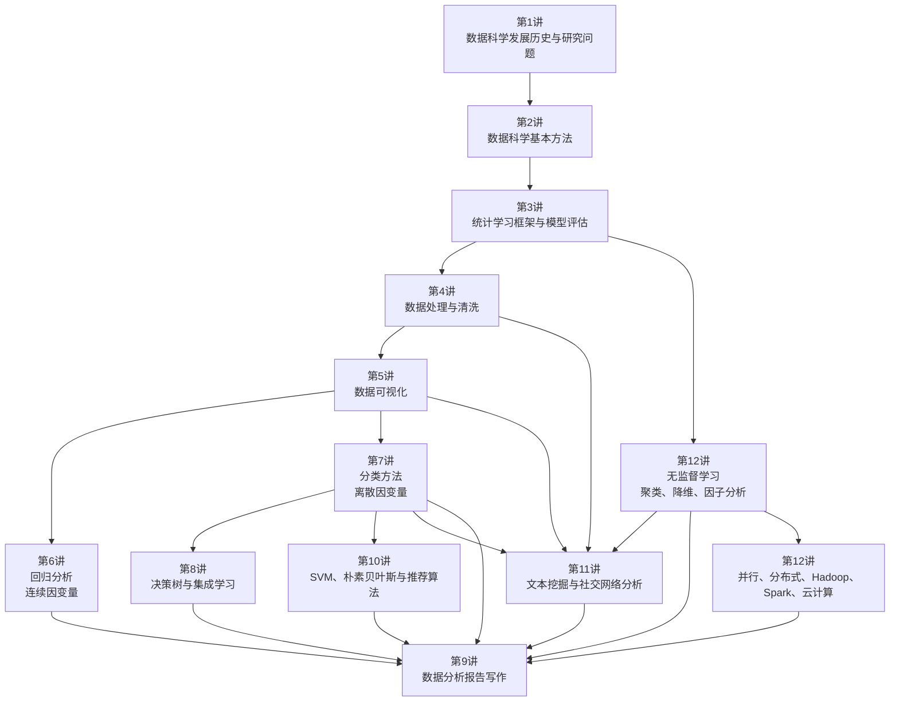

# 数据科学导论第1-12讲课程讲稿汇总

本文基于“数据科学导论”第 1-12 讲课程讲稿整理，重点概括每讲的主要内容、核心概念和学习注意事项。整体课程逻辑是：先建立数据科学的问题意识和方法框架，再完成数据处理与可视化，随后进入监督学习、无监督学习、文本与网络等方法，最后回到报告写作与大规模计算实践。

## 12讲关系图

## 课程总览

| 讲次 | 主题 | 在课程中的作用 |
|---|---|---|
| 第1讲 | 数据科学的发展历史与研究问题 | 建立问题导向，理解数据科学从统计学、数据挖掘、机器学习到综合交叉学科的演进 |
| 第2讲 | 数据科学的基本方法 | 建立监督学习、无监督学习、半监督学习、强化学习等方法地图 |
| 第3讲 | 统计学习的基本框架与模型评估 | 理解模型、策略、算法三要素，以及过拟合、正则化、交叉验证和泛化能力 |
| 第4讲 | 数据处理与清洗 | 说明原始数据必须经过缺失值、噪声、异常值和标准化处理后才能建模 |
| 第5讲 | 数据可视化 | 用图形探索分布、关系、趋势、异常，并服务结果表达 |
| 第6讲 | 回归分析 | 处理连续型因变量，完成变量关系解释、显著性检验和数值预测 |
| 第7讲 | 分类方法 | 处理离散型因变量，学习概率分类、判别分析和分类评价指标 |
| 第8讲 | 决策树与集成学习 | 从可解释树模型扩展到 Bagging、随机森林、Boosting、GBDT、XGBoost |
| 第9讲 | 数据分析报告写作指南 | 把数据、方法、图表和模型结果组织成有问题意识、有证据、有建议的报告 |
| 第10讲 | 支持向量机、朴素贝叶斯与推荐算法 | 学习最大间隔分类、概率分类和推荐系统应用 |
| 第11讲 | 文本挖掘与社交网络分析 | 处理文本内容和关系网络两类重要非结构化数据 |
| 第12讲 | 无监督学习与大数据计算方法 | 学习聚类、PCA、因子分析、典型相关分析，以及并行、分布式和云计算 |

## 第1讲：数据科学的发展历史与研究问题

原讲稿：[第1讲：数据科学的发展历史与研究问题]({{ '/teaching/datascience/chap1-introduction' | prepend: site.baseurl }})

主要内容：
- 梳理数据科学从古典统计、近代统计、现代统计到高维数据、数据挖掘、机器学习、大数据和数据科学阶段的演进。
- 强调数据科学不是单纯处理数据，而是围绕现实问题完成数据收集、清洗、建模、解释与决策支持。
- 介绍数据科学常见研究问题：关系发现与预测、分类与风险识别、影响因素识别、关联规则与推荐、降维与综合评价、聚类与细分、文本挖掘与情感分析。

核心概念：
- 数据科学、统计学、数据挖掘、机器学习、大数据。
- 现实问题、数据问题、模型问题、决策支持。
- 回归、分类、变量筛选、推荐、聚类、文本挖掘。

注意事项：
- 不要把数据科学等同于“大数据”或“机器学习”。数据科学更强调问题、数据、方法、解释和行动之间的完整链条。
- 方法不是起点，现实问题才是起点。应先明确要回答什么问题，再选择数据和模型。
- 模型结果最终必须转化为可解释、可行动的结论。

## 第2讲：数据科学的基本方法

原讲稿：[第2讲：数据科学的基本方法]({{ '/teaching/datascience/chap2-datascience' | prepend: site.baseurl }})

主要内容：
- 建立数据科学方法体系，说明统计学方法和机器学习方法在现代数据科学中的融合关系。
- 介绍监督学习、无监督学习、半监督学习和强化学习。
- 说明监督学习中的回归、分类和标注问题；无监督学习中的聚类、降维、关联规则和主题发现。
- 讨论机器学习、数据挖掘和统计学习之间的联系与差异。

核心概念：
- 监督学习、无监督学习、半监督学习、强化学习。
- 实例、特征向量、特征空间、训练集、标签。
- 模型、策略、算法。
- 损失函数、风险函数、经验风险、正则化、交叉验证。

注意事项：
- 监督学习需要已知输出标签，无监督学习不依赖标签，两者适用场景不同。
- 统计学习更强调建模、推断和可解释性，机器学习更强调预测性能和算法实现，但二者不是对立关系。
- 不能只追求模型复杂度，要关注任务目标、数据条件、可解释性和泛化能力。

## 第3讲：统计学习的基本框架与模型评估

原讲稿：[第3讲：统计学习的基本框架与模型评估]({{ '/teaching/datascience/chap3-datasciencemethod' | prepend: site.baseurl }})

主要内容：
- 系统说明统计学习的三要素：模型、策略、算法。
- 介绍损失函数、风险函数、经验风险最小化和结构风险最小化。
- 讨论训练误差、测试误差、过拟合、欠拟合、正则化、交叉验证和泛化能力。
- 引出模型选择的基本思想：在拟合能力和模型复杂度之间取得平衡。

核心概念：
- Model = 假设空间或候选函数集合。
- Policy = 衡量模型好坏的标准，如损失函数和风险函数。
- Algorithm = 求解最优模型的方法。
- ERM、SRM、训练误差、测试误差、泛化误差。
- Ridge、Lasso、训练集、验证集、测试集、S 折交叉验证、留一交叉验证。

注意事项：
- 训练误差低不代表模型好，真正重要的是测试误差和泛化能力。
- 过拟合通常来自模型复杂度过高、样本量不足或噪声拟合。
- 正则化不是为了让训练误差最低，而是为了控制复杂度，提高未知数据表现。
- 测试集应尽量只用于最终评估，不能反复参与调参。

## 第4讲：数据处理与清洗

原讲稿：[第4讲：数据处理与清洗]({{ '/teaching/datascience/chap4-datacleaning' | prepend: site.baseurl }})

主要内容：
- 介绍结构化数据与非结构化数据，以及数据的计量尺度。
- 说明数据清洗的目标：处理缺失值、噪声、异常值、不一致、重复和错误数据。
- 讲解缺失值类型：完全随机缺失、随机缺失、完全非随机缺失。
- 介绍均值插补、多重插补、分箱、聚类平滑、回归平滑、Box-Cox 转换、标准化和归一化。

核心概念：
- 结构化数据、非结构化数据。
- 分类数据、有序数据、区间数据、比例数据。
- MCAR、MAR、MNAR。
- 缺失值、噪声、异常值、数据变换、z-score 标准化、min-max 标准化、比例归一化。

注意事项：
- 原始数据不能直接进入模型，数据质量往往比模型复杂度更重要。
- 缺失值处理要先判断缺失机制。非随机缺失可能导致有偏估计，简单删除或均值填补并不总是合适。
- 异常值不一定是错误值，删除前应结合业务背景和统计依据。
- 标准化方法要与后续算法匹配；距离类、正则化类和降维类方法通常更依赖标准化。

## 第5讲：数据可视化

原讲稿：[第5讲：数据可视化]({{ '/teaching/datascience/chap5-datavis' | prepend: site.baseurl }})

主要内容：
- 说明可视化在探索数据、发现规律、验证模型、沟通结果和辅助决策中的作用。
- 介绍基础作图参数、标题、坐标轴、参考线、图例、文本标注和图形组合。
- 按分析目的和数据类型归纳常见图形：条形图、饼图、直方图、密度图、箱线图、散点图、折线图、热力图、地图等。
- 介绍 ggplot2 的图形语法：数据、映射、标度、几何对象、统计变换、坐标系统、图层和分面。

核心概念：
- 视觉编码、探索性数据分析、图形语法。
- 分布、关系、趋势、结构、异常值。
- Data、Mapping、Scale、Geometric、Statistics、Coordinate、Layer、Facet。

注意事项：
- 可视化不是装饰，而是分析和表达的一部分。
- 图形选择必须服务问题：看分类比较用条形图，看分布用直方图/密度图/箱线图，看关系用散点图，看趋势用折线图。
- 避免图形元素过多、颜色复杂、坐标轴截断误导、图形与数据类型不匹配。
- 每张图最好服务一个核心结论。

## 第6讲：回归分析

原讲稿：[第6讲：回归分析]({{ '/teaching/datascience/chap6-regression' | prepend: site.baseurl }})

主要内容：
- 介绍回归分析如何刻画变量之间的数量关系，并用于解释、推断和预测。
- 讲解一元线性回归的总体回归函数、随机误差项、样本回归函数和残差。
- 介绍经典线性回归假设、普通最小二乘估计、BLUE 性质、拟合优度检验、显著性检验和区间预测。
- 扩展到多元线性回归，介绍矩阵表达、参数估计、残差方差估计和模型检验。
- 说明 R 中 `lm()`、`coef()`、`summary()`、`predict()` 等函数的基本使用。

核心概念：
- 因变量、自变量、总体回归函数、样本回归函数、随机误差项、残差。
- OLS、残差平方和、BLUE、高斯-马尔可夫定理。
- TSS、ESS、RSS、\(R^2\)、调整 \(R^2\)、t 检验、F 检验。
- 点预测、均值置信区间、个体预测区间。

注意事项：
- 相关分析不能替代回归分析。相关说明同步变化，回归进一步刻画方向、强度、控制变量和预测。
- 回归系数解释依赖模型设定和变量尺度，不能脱离单位和控制条件。
- \(R^2\) 高不一定代表模型合理，仍需检查变量意义、假设条件和外推风险。
- 回归结果通常说明统计关联，不能轻易写成因果关系。

## 第7讲：分类方法

原讲稿：[第7讲：分类方法]({{ '/teaching/datascience/chap7-classification' | prepend: site.baseurl }})

主要内容：
- 说明分类问题处理离散型因变量，与回归问题处理连续型因变量相区分。
- 介绍线性概率模型及其概率越界、异方差和误差分布问题。
- 讲解 Probit 和 Logistic 模型如何通过分布函数把线性组合映射到 \(0,1\) 区间。
- 从潜变量、最大似然估计、边际效应和似然比检验角度理解二元选择模型。
- 介绍判别分析、朴素贝叶斯、LDA、QDA。
- 讲解混淆矩阵、Accuracy、Recall、Specificity、Precision、ROC 和 AUC。

核心概念：
- 分类器、二元分类、多类别分类。
- LPM、Probit、Logit、链接函数、赔率、优势比、潜变量。
- 最大似然估计、边际效应、似然比检验。
- 贝叶斯分类器、朴素贝叶斯、LDA、QDA。
- TP、FP、FN、TN、Accuracy、Precision、Recall、ROC、AUC。

注意事项：
- 二元分类不宜简单套用线性回归，因为预测概率可能越界且误差结构不合适。
- Logistic 系数不能像线性回归系数一样直接解释为概率变化，通常需要解释赔率或边际效应。
- 类别不平衡时，Accuracy 可能误导，应结合 Precision、Recall、F1、ROC/AUC 等指标。
- 医学筛查、风控预警和垃圾邮件识别对“错判类型”的代价不同，评价指标要匹配应用场景。

## 第8讲：决策树与集成学习

原讲稿：[第8讲：决策树与集成学习]({{ '/teaching/datascience/chap8-tree-ensemble' | prepend: site.baseurl }})

主要内容：
- 介绍决策树和 CART 思想，说明树模型既可用于分类，也可用于回归。
- 讲解节点、递归二叉分裂、特征空间划分、分裂准则和节点不纯度。
- 介绍分类树、回归树和剪枝，强调单棵树的可解释性与过拟合风险。
- 介绍 Bagging、随机森林、Boosting、AdaBoost、GBDT 和 XGBoost。
- 说明单棵树强调解释，组合树强调预测。

核心概念：
- 根节点、中间节点、叶节点、递归二叉分裂。
- 分类树、回归树、Gini 指数、交叉熵、分类错误率、RSS。
- 事先剪枝、事后剪枝、代价复杂性剪枝。
- Bagging、Bootstrap、随机森林、OOB、变量重要性。
- Boosting、AdaBoost、GBDT、XGBoost、学习率、树深、正则项。

注意事项：
- 单棵树直观但方差大，数据轻微扰动可能导致完全不同的树结构。
- Bagging 主要通过并行平均降低方差；随机森林在 Bagging 基础上进一步降低树之间相关性。
- Boosting 是串行纠错，通常预测能力强，但更依赖调参，也更容易受噪声影响。
- 集成模型性能提升通常伴随解释性下降，需要结合变量重要性、局部解释或业务理解。

## 第9讲：数据分析报告写作指南

原讲稿：[第9讲：数据分析报告写作指南]({{ '/teaching/datascience/chap9-data-analysis-report-writing' | prepend: site.baseurl }})

主要内容：
- 说明数据分析报告不是数据罗列、图表堆砌或方法展示，而是用数据回答有价值的问题。
- 介绍报告结构：标题、摘要、背景、研究目标、数据来源、变量说明、数据处理、方法、结果、发现、结论、建议、局限性、参考文献和附录。
- 讲解标题、摘要、背景、研究目标、数据说明、变量说明和方法选择的写法。
- 强调结果写作要从“看到了什么”推进到“说明了什么、为什么如此、有什么意义”。
- 给出图表规范、发现提炼、结论写作、建议写作、局限性说明和课程报告评分标准。

核心概念：
- 问题意识、数据证据、方法适配、结果解释、结论提炼、建议落地。
- 技术路线：数据获取 -> 数据清洗 -> 变量构建 -> 描述性分析 -> 差异分析 -> 关系分析 -> 模型分析 -> 结论提炼 -> 对策建议。
- 主要发现、结论、建议、局限性、可复现性。

注意事项：
- 方法不是越复杂越好，关键是是否回答研究问题。
- 图表不能只配“如图所示”，必须解释图表背后的发现和意义。
- 结论必须有数据支撑，建议必须与发现对应，避免空泛的“加强、优化、完善”。
- 要主动说明样本代表性、横截面数据、因果解释、变量测量和模型假设等局限。

## 第10讲：支持向量机、朴素贝叶斯与推荐算法

原讲稿：[第10讲：支持向量机与朴素贝叶斯、推荐算法]({{ '/teaching/datascience/chap10-svm-bayes-recommendation' | prepend: site.baseurl }})

主要内容：
- 介绍支持向量机的基本思想：在特征空间中寻找最大间隔分类超平面。
- 讲解最大间隔分类器、软间隔、核函数技巧和支持向量回归。
- 介绍朴素贝叶斯的贝叶斯分类器思想和条件独立假设。
- 讲解推荐算法的主要类型：协同过滤、内容推荐、相似性推荐、关联规则推荐和深度学习推荐。
- 说明不同推荐算法分别利用用户-物品交互、物品内容、项目共现关系和多源异构数据。

核心概念：
- 超平面、最大间隔、支持向量、软间隔、核函数、RBF 核、SVR。
- 贝叶斯分类器、后验概率、条件独立假设。
- 协同过滤、用户相似、物品相似、冷启动、数据稀疏。
- 支持度、置信度、提升度、内容推荐、混合推荐系统。

注意事项：
- SVM 适合边界清晰或高维分类任务，但若需要直接概率解释，Logistic 回归更方便。
- 核函数能处理非线性边界，但也会增加调参与解释难度。
- 朴素贝叶斯的条件独立假设常常不完全成立，但在文本分类等高维任务中仍然有效。
- 推荐系统要关注冷启动、稀疏矩阵、热门偏置和信息茧房问题，实际平台常使用混合推荐。

## 第11讲：文本挖掘与社交网络分析

原讲稿：[第11讲：文本挖掘与社交网络分析]({{ '/teaching/datascience/chap11-text-mining-social-network' | prepend: site.baseurl }})

主要内容：
- 把文本数据和关系数据作为两类重要非结构化数据来讨论。
- 介绍文本挖掘流程：数据获取、清洗、分词、标准化、特征抽取、矩阵表示、分类、聚类、主题模型和结果解释。
- 讲解布尔模型、向量空间模型、概率模型、分词、词干抽取、TF-IDF、特征选择和 LDA 主题模型。
- 介绍社交网络分析的图结构表示、邻接矩阵、节点度、中心性、凝聚性、网络分割、随机图模型、ERGMs、块模型和关联网络推断。
- 说明文本挖掘关注“内容”，社交网络分析关注“关系”，二者常在社交媒体和传播研究中结合使用。

核心概念：
- 语料库、词项、分词、停用词、词袋模型、词频、TF-IDF。
- 文本分类、文本聚类、LDA 主题模型、情感分析。
- 图、节点、边、有向图、无向图、邻接矩阵、权重矩阵。
- 度中心性、接近中心性、介数中心性、特征向量中心性。
- 团、k 核、密度、聚类系数、社团发现、ERGMs、SBM、Graphical Lasso。

注意事项：
- 文本预处理不是清得越干净越好，而是要保留与研究问题相关的信息。
- TF-IDF 兼顾词在单篇文档中的频率和在整体语料中的区分度，高频常用词不一定重要。
- 聚类和主题模型结果需要结合语境解释，不能只看算法输出。
- 网络中心性指标回答的问题不同，不能把“连接多”等同于所有意义上的“重要”。
- 相关网络不等于因果网络，偏相关和图模型也仍需谨慎解释。

## 第12讲：无监督学习与大数据计算方法

原讲稿：[第12讲：无监督学习与大数据计算方法]({{ '/teaching/datascience/chap12-unsupervised-and-computing' | prepend: site.baseurl }})

主要内容：
- 介绍无监督学习如何在无标签数据中发现样本分组、变量结构和低维表示。
- 讲解聚类分析、相异度与距离、K-means、系统聚类、PCA、因子分析和典型相关分析。
- 说明大数据环境下的计算需求，介绍 4V 特征：Volume、Variety、Value、Velocity。
- 讲解并行计算、分布式计算、Hadoop、HDFS、MapReduce、Spark 和云计算。
- 强调数据科学不仅要理解算法，还要理解计算资源、存储架构和任务拆分方式。

核心概念：
- 无监督学习、Q 型聚类、R 型聚类、距离、相异度。
- 欧氏距离、马氏距离、余弦相似度。
- K-means、系统聚类、谱系图。
- PCA、主成分、方差最大化、因子分析、公共因子、因子载荷、典型相关分析。
- 并行计算、分布式计算、HDFS、MapReduce、Spark、SaaS、PaaS、IaaS。

注意事项：
- 聚类结果高度依赖距离度量、变量标准化、类别数和初始值。
- K-means 计算效率高，但需要预先给定 K，且对异常值和初始中心敏感。
- PCA 和因子分析都能降维，但 PCA 更关注信息压缩，因子分析更关注潜在公共结构。
- MapReduce 适合批处理，Spark 更适合需要多轮迭代的机器学习任务。
- 并行不一定越多越快，数据传输、节点初始化和结果合并也有成本。

## 跨讲次学习主线

1. **问题导向主线**：第1讲提出数据科学要从现实问题出发，第9讲要求把所有分析重新组织成能够回答问题的报告。
2. **方法框架主线**：第2-3讲提供监督学习、无监督学习和统计学习框架，后续所有模型都可以放回“模型、策略、算法”和“评估、泛化、正则化”的框架中理解。
3. **数据准备主线**：第4-5讲说明建模前必须先清洗数据、理解数据、可视化数据，这是后续回归、分类、聚类和文本分析的基础。
4. **监督学习主线**：第6-8讲和第10讲围绕有标签预测展开，覆盖回归、分类、决策树、集成学习、SVM 和朴素贝叶斯。
5. **无监督与非结构化数据主线**：第11-12讲处理文本、网络、聚类、降维和大数据计算，扩展了结构化表格数据之外的分析能力。
6. **实践输出主线**：所有分析最终都要服务第9讲强调的报告写作：问题明确、数据可靠、方法合适、结果有解释、结论有证据、建议能落地。

## 总结

第 1-12 讲共同构成了一条完整的数据科学学习路径：先理解数据科学为何产生、研究什么问题、有哪些方法；再掌握数据清洗和可视化等基础工作；随后学习回归、分类、树模型、SVM、朴素贝叶斯、推荐算法、文本挖掘、网络分析和无监督学习等核心方法；最后通过报告写作和大数据计算方法，把模型结果转化为可解释、可复现、可行动的数据分析成果。
