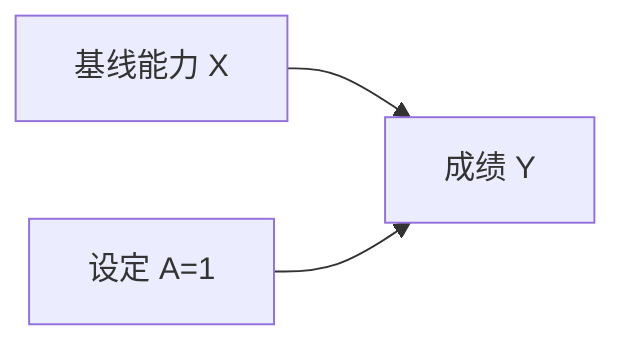

# 第一讲：因果推断的基本框架

> 课程定位：高级统计学方法；适用于具备概率、条件期望与回归分析基础的学生。  
> 核心问题：我们如何把“如果采取另一种行动，结果会怎样”写成可以分析的统计问题？

## 一、学习目标与课程地图

完成本讲后，应能够：

1. 区分相关、预测、干预和反事实问题。
2. 用潜在结果定义个体效应、总体平均效应和处理组平均效应。
3. 用结构方程和有向无环图表达数据生成机制。
4. 区分混杂变量、中介变量和碰撞变量，解释为什么控制变量并非越多越好。
5. 区分因果效应的定义、识别和估计，并为一个研究问题写出基本假设。

三讲之间的关系：


因果发现并不是每个效应估计项目的必要前置步骤。若研究设计和领域知识足以支持相关结构，就可以直接研究目标效应的识别。

## 二、贯穿案例：课外辅导是否提高成绩？

学校观察到参加辅导的学生期末平均成绩为 82 分，未参加学生为 76 分。

直接计算得到 6 分差异，但它可能来自：

- 辅导本身提高了成绩。
- 学习动机强的学生更愿意参加辅导，也更容易取得高分。
- 家庭资源同时影响辅导机会和学业表现。
- 基础薄弱的学生更可能报名补习，使辅导组原本的成绩更低。

因此，“两组相差 6 分”和“让同一目标人群接受辅导能提高 6 分”是不同的陈述。

### 2.1 先写清研究问题

一个可以开展的研究至少需要说明以下内容。

| 要素 | 本讲示例 |
|---|---|
| 目标人群 | 本校本学期所有符合报名条件的学生 |
| 处理 | 接受统一内容、每周两小时、持续八周的辅导 |
| 对照 | 不接受该项辅导，维持通常教学 |
| 结果 | 八周结束后统一考试的分数 |
| 基线信息 | 辅导开始前的成绩、家庭资源、学习动机等 |
| 目标效应 | 在目标人群中实施该辅导的平均成绩变化 |

“辅导”若同时包含不同教师、不同课时、不同课程内容，应先明确这些版本是否属于同一个处理。否则，讨论的干预本身就可能不够清楚。

### 2.2 四类问题

| 类型 | 示例 | 需要的核心信息 |
|---|---|---|
| 相关 | 辅导与成绩是否相关？ | 观测联合分布 |
| 预测 | 已知是否辅导，能否更准确预测成绩？ | 可用于预测的新样本分布 |
| 干预 | 如果让目标人群都参加辅导，成绩会怎样？ | 数据与干预机制假设 |
| 反事实 | 某学生已参加辅导并得了 85 分，若没参加会得多少分？ | 对个体机制和未观测量更强的约束 |

预测模型可以利用结果的代理变量或后果变量提高准确率，而这些变量未必适合用于估计干预效应。预测性能不是因果解释的充分条件。

## 三、统一符号

三份讲义共同使用下列记号。

| 记号 | 含义 |
|---|---|
| $A\in\{0,1\}$ | 是否接受处理 |
| $Y$ | 实际观察的结果 |
| $X$ | 处理之前测量的协变量，可以是向量 |
| $U$ | 未观测的因素或外生扰动，具体含义由模型说明 |
| $M$ | 处理中介变量 |
| $S$ | 选择变量或碰撞变量 |
| $Z$ | 工具变量，第二讲使用 |
| $Y(a)$ | 若接受处理 $a$ 时的潜在结果 |
| $e(X)$ | 倾向评分 $P(A=1\mid X)$ |
| $m_a(X)$ | 结果回归 $E(Y\mid A=a,X)$ |

第三讲在讨论一般网络时使用 $V_1,\ldots,V_p$ 表示节点，以免与处理变量和协变量混淆。

## 四、潜在结果框架

### 4.1 从同一个体的比较定义效应

对学生 $i$，定义：

$$
Y_i(1)=\text{该学生接受辅导时的成绩},\qquad
Y_i(0)=\text{该学生不接受辅导时的成绩}.
$$

个体处理效应为：

$$
\tau_i=Y_i(1)-Y_i(0).
$$

这一定义比较的是同一个学生在两个干预状态下的结果，因而不会把学生之间原本存在的差异直接当作辅导效应。

### 4.2 因果推断的基本困难

通常只能观察到两个潜在结果之一：

$$
Y_i=A_iY_i(1)+(1-A_i)Y_i(0).
$$

以下数字是为说明概念而构造的完整潜在结果，不代表真实研究中可以同时观测。

| 学生 | $Y_i(0)$ | $Y_i(1)$ | 个体效应 | 实际处理 $A_i$ | 实际观察 $Y_i$ |
|---|---:|---:|---:|---:|---:|
| 甲 | 60 | 70 | 10 | 1 | 70 |
| 乙 | 70 | 74 | 4 | 0 | 70 |
| 丙 | 80 | 82 | 2 | 1 | 82 |
| 丁 | 90 | 88 | -2 | 0 | 90 |

四名学生的平均效应为：

$$
\frac{10+4+2-2}{4}=3.5.
$$

但实际处理组均值是 76，对照组均值是 80，观测差异为 $-4$。这说明组间观测差异可能与平均因果效应不同，甚至符号相反。

即使处理经过随机分配，有限样本中的一次分配仍可能不平衡。随机化保证的是分配机制下的可比性及相应估计性质，不保证每一次实验的样本差异都恰好等于真实效应。

### 4.3 三种常用目标效应

**总体平均处理效应 ATE：**

$$
\tau_{ATE}=E\{Y(1)-Y(0)\}.
$$

**处理组平均处理效应 ATT：**

$$
\tau_{ATT}=E\{Y(1)-Y(0)\mid A=1\}.
$$

**条件平均处理效应 CATE：**

$$
\tau(x)=E\{Y(1)-Y(0)\mid X=x\}.
$$

ATE 关注目标总体，ATT 关注实际接受处理的人群，CATE 关注某类具有共同特征的人。它们一般不相等；CATE 也不是每个个体不可观测效应的直接测量。

例如，辅导对基础较弱学生帮助较大，而这类学生更经常报名，则 ATT 可能高于 ATE。报告结果时必须同时报告目标人群。

## 五、从观测差异到因果效应：识别需要什么？

### 5.1 一致性、无干扰与处理版本

一致性要求：若学生实际接受处理 $A=a$，则观察结果等于相应潜在结果 $Y(a)$。

无干扰要求：某学生的结果不受其他学生处理状态的影响。若辅导学生把学习资料分享给未辅导学生，该条件就可能失效，应考虑同伴暴露或群体处理。

通常所说的 SUTVA 包括无个体间干扰及不存在未明确区分的处理版本。教材对一致性与 SUTVA 的组织方式可能不同，研究中应直接说明具体要求，避免只写缩写。

### 5.2 可交换性

随机化试验理想情况下具有：

$$
\{Y(1),Y(0)\}\perp A.
$$

观察性研究常假设条件可交换性：

$$
\{Y(1),Y(0)\}\perp A\mid X.
$$

其含义是：在给定 $X$ 的人群中，是否接受处理不再携带关于潜在结果的额外信息。它并不要求两组观察结果相同；处理本身仍可改变结果。

该条件通常不能仅凭观测数据完全检验。例如，未记录的学习动机仍可能同时影响辅导选择和成绩。

### 5.3 正值性与共同支持

常用表达为：

$$
0<P(A=1\mid X=x)<1.
$$

直观上，需要有可比较的处理与对照观测。课堂实施时，可以把这一条件简化为总体层面的 $0<P(A=1)<1$：只要样本同时包含处理者与未处理者，缺少某些协变量层内的对照不会破坏识别，因为结果回归可以补齐这些层的反事实均值。

这一区分提示我们，分层样本不足主要是估计精度问题，可通过更灵活的预测模型改善。

### 5.4 组间差异的偏差分解

利用一致性，可写出：

$$
\begin{aligned}
E(Y\mid A=1)-E(Y\mid A=0)
&=E\{Y(1)\mid A=1\}-E\{Y(0)\mid A=0\}\\
&=\underbrace{E\{Y(1)-Y(0)\mid A=1\}}_{ATT}\\
&\quad+\underbrace{E\{Y(0)\mid A=1\}-E\{Y(0)\mid A=0\}}_{选择偏差}.
\end{aligned}
$$

第二项回答：“即使都不接受辅导，两组学生本来会不会不同？”只要这一项不为零，原始均值差就不能直接解释为 ATT。

### 5.5 识别与估计是两个问题

**识别**研究：给定假设，即使知道完整观测分布，目标效应能否被唯一确定？

**估计**研究：在目标已识别的前提下，如何用有限样本计算它，并量化不确定性？

不可识别不是简单的“样本不够大”。两个不同的数据生成机制可能产生相同观测分布，却给出不同干预效应。仅增加相同类型的数据未必能区分它们。

## 六、结构因果模型：把机制写出来

### 6.1 结构方程

以基线学习能力 $X$、是否辅导 $A$、成绩 $Y$ 为例：

$$
X=f_X(U_X),\qquad
A=f_A(X,U_A),\qquad
Y=f_Y(A,X,U_Y).
$$

结构方程不仅描述条件均值，还表达变量如何产生，以及干预发生时哪些机制被替换。

外生变量之间若存在依赖，需要在模型中说明其含义；在观测变量图中，它可能对应未测共同原因。不能仅凭写出几条回归方程就宣称已经获得了可信的因果模型。

### 6.2 有向无环图 DAG


节点表示变量，箭头表示假设中的直接因果影响。直接是相对于图中纳入的变量而言的。若补充了中间机制，原先的一条箭头可能被拆成多条路径。

“无环”指不存在沿箭头方向返回起点的路径。现实中若有反馈，可以在有依据时展开时间顺序，如“第一周投入→第二周成绩→第三周投入”，不能把同一时间点的反馈直接塞进 DAG。

## 七、条件化与干预为什么不同？

### 7.1 观察到参加辅导

条件分布

$$
P(Y\mid A=1)
$$

描述的是自然选择下已经参加辅导的人。这些人的基线能力和家庭资源分布可能不同于总体。

### 7.2 强制设置辅导状态

干预分布

$$
P\{Y\mid do(A=1)\}
$$

描述的是把目标人群的辅导状态设为 1 后的成绩分布。结构模型中用 $A:=1$ 替换原来的 $A=f_A(X,U_A)$。

图上应删除进入 $A$ 的箭头，保留从 $A$ 指向后续变量的箭头。



在完整观测、相应机制假设成立的简单图中：

$$
P\{Y=y\mid do(A=a)\}=\sum_xP(Y=y\mid A=a,X=x)P(X=x).
$$

而观测条件分布为：

$$
P(Y=y\mid A=a)=\sum_xP(Y=y\mid A=a,X=x)P(X=x\mid A=a).
$$

两者的区别是使用总体的 $X$ 分布，还是实际处理组的 $X$ 分布。这也说明标准化为什么要先确定目标人群。

## 八、因果图中的三种基本结构

### 8.1 共同原因：混杂路径

```text
A ← X → Y
```

$X$ 同时影响处理与结果，使 $A$ 和 $Y$ 即使没有直接因果联系也可能相关。对 $X$ 条件化可以阻断这条路径。

### 8.2 链式结构：中介路径

```text
A → M → Y
```

例如“辅导→学习方法改善→成绩提高”。若目标是总效应，直接控制 $M$ 会阻断这条机制。直接效应或中介效应是不同的目标，需要另外定义并论证识别条件。

回归中加入中介变量后，$A$ 的系数不自动等于某一种有明确因果定义的直接效应。

### 8.3 碰撞结构：控制可能引入偏差

```text
A → S ← U → Y
```

例如辅导和学习动机都会影响是否进入某个“优秀学生样本” $S$。在总体中，路径在碰撞点 $S$ 处被阻断；只分析入选者，相当于条件化 $S$，可能打开非因果路径。

### 8.4 d-分离的操作规则

给定条件集合 $C$，一条路径开放需要满足：

1. 路径上的每个非碰撞节点都不在 $C$ 中。
2. 路径上的每个碰撞节点本身或其某个后代在 $C$ 中。

如果所有路径均被阻断，两个节点集合在图上 d-分离。在因果 Markov 条件下，d-分离蕴含条件独立。

这里的路径可以逆着箭头走；判断某节点是否为碰撞点，要看它在当前路径上的两个相邻箭头是否都指向该节点。

## 九、两种框架如何配合？

| 任务 | 潜在结果语言 | 结构模型与图语言 |
|---|---|---|
| 定义处理效应 | $E\{Y(1)-Y(0)\}$ | 比较两种干预下的结果均值 |
| 表达可比性 | $Y(a)\perp A\mid X$ | 选择能阻断非因果路径的调整集 |
| 解释干预 | 将潜在结果状态设为 $a$ | 替换 $A$ 的结构方程 |
| 说明研究限制 | 潜在结果缺失与不可交换 | 未测混杂、错误结构或开放路径 |

在同一套一致的模型假设下，可以把 $Y(a)$ 理解为结构模型执行 $do(A=a)$ 后得到的结果。两种语言可以相互帮助，但画图不能免除对箭头来源的论证，潜在结果记号也不能代替识别假设。

### 反事实的三个步骤：拓展阅读

结构模型中的个体反事实通常按照“推断外生状态—修改处理机制—预测新结果”分析。

例如假定 $Y=50+5A+U$，某学生在 $A=1$ 时得分 80，则可推断 $U=25$；再设置 $A=0$，得到反事实分数 75。这一结论依赖整个确定性结构与个体扰动不变的假设，不能仅凭普通回归拟合直接成立。

## 十、课堂活动：从问题到方案

四人一组，为辅导案例完成以下任务。

1. 明确处理版本、观察时间和目标总体。
2. 至少画出两个不同的合理 DAG。
3. 为各图列出建议收集的基线变量。
4. 标记一个不应为了估计总效应而直接控制的变量。
5. 说明如果缺少学习动机，哪一步论证会变弱。
6. 分别写出 ATE 和 ATT，解释学校当前决策更关注哪一个。

**提交成果：**一页研究问题说明、一张带变量解释的 DAG，以及不超过 200 字的假设说明。

## 十一、常见误区

| 说法 | 需要怎样修正 |
|---|---|
| 显著相关就是存在因果效应 | 显著性只涉及模型下的统计证据，不提供完整识别依据 |
| 控制越多变量越好 | 需判断变量在图中的角色及测量时间 |
| 随机化后两组每个变量一定相同 | 有限样本仍会随机不平衡 |
| 个体的 CATE 就是其真实效应 | CATE 是同类人群平均效应 |
| 画出 DAG 就证明了结构 | DAG 表达需要论证的假设 |
| 增大样本一定消除混杂 | 样本量不自动解决设计和识别问题 |

## 十二、习题与参考答案

### 题 1：区分目标

学校考虑是否给全体学生提供辅导；另一个部门只想评价已经参加者获益多少。两者分别对应什么目标？

**答案：**前者通常对应目标学生总体的 ATE，后者对应 ATT。若“提供机会”与“实际参加”不同，还需要重新区分分配效应与接受处理效应。

### 题 2：偏差分解

观测成绩差为 6 分，已知未处理潜在结果的选择偏差为 4 分。ATT 是多少？

**答案：**由观测差异 $=ATT+选择偏差$，得到 $ATT=6-4=2$ 分。这里的选择偏差在真实数据中通常不可直接观察。

### 题 3：处理后变量

研究辅导总效应时，是否应控制辅导后的学习时间？

**答案：**不能仅因它预测成绩就纳入。若学习时间是辅导产生作用的中介，控制它会改变目标路径；若还有未测共同原因，还可能带来额外偏差。

### 题 4：碰撞点

在 $A\to S\leftarrow U\to Y$ 中，原路径是否开放？控制 $S$ 后呢？

**答案：**未控制 $S$ 或其后代时，路径在 $S$ 处阻断；控制 $S$ 后该路径可能开放，使处理和结果之间出现非因果关联。

### 题 5：共同支持

总体包含处理和对照，但所有基础薄弱学生都接受了辅导。能否通过回归识别基础薄弱学生的平均效应？

**答案：**可以。总体中两种处理都出现已经满足正值性的实际要求；对基础薄弱层缺失的对照均值可用其他学生的回归关系预测，因此这里主要增加模型拟合的不确定性，不构成识别障碍。

### 退出题

用一句话补全：因果推断不是仅从相关性推到因果性，而是从“______、______和______”共同推导干预结论。

**参考：**清晰的目标问题、观测或实验数据、明确的因果假设。

## 十三、阅读指引

1. **主读：苗旺、刘春辰、耿直《因果推断的统计方法》**，重点读第 2 节和第 6.1 节。思考潜在结果如何定义效应，图模型如何定义干预。
2. **进阶：Judea Pearl, “Causal inference in statistics: An overview”**，重点读第 3 节、第 4 节。比较结构模型和潜在结果两种语言。
3. **辅助：丁鹏课程讲义**，结合课堂符号对照其处理效应和实验设计部分。

本讲案例、活动及练习为教学构造，不是阅读文献中的实证结果。原始材料使用的处理变量符号可能与本讲不同。

- 苗旺等：因果推断的统计方法（参考文献）
- Pearl：Causal inference in statistics: An overview（参考文献）
- 丁鹏课程讲义（参考文献）

**下一讲：**[因果效应的识别与估计](lecture-02.md)。
