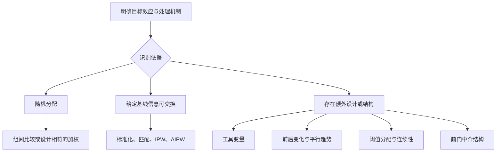

# 第二讲：因果效应的识别与估计

> 前置知识：第一讲的潜在结果、条件可交换性、因果图及条件期望。  
> 核心问题：目标效应在什么条件下可以从数据中得到，又应如何计算？

## 一、学习目标

完成本讲后，应能够：

1. 为目标效应列出识别条件，并区分条件本身与可观察的诊断。
2. 推导标准化公式和逆概率加权公式。
3. 解释回归调整、倾向评分匹配、IPW 与 AIPW 的异同。
4. 说明后门、前门、工具变量、双重差分和断点回归分别利用什么信息识别效应。
5. 完成一份包含目标人群、估计值、不确定性和假设限制的分析报告。

本讲统一使用 $A$ 表示处理、$Y$ 表示结果、$X$ 表示处理前协变量。默认讨论二值处理和平均处理效应，其他目标会明确说明。

## 二、先确定估计目标，再选择方法

### 2.1 一份分析方案的最小组成

在选择软件或模型之前，应回答：

1. 处理是什么，与对照之间具体差在哪里？
2. 结果在什么时间测量？
3. 目标人群是谁？
4. 希望估计 ATE、ATT、某个阈值处的局部效应，还是依从者效应？
5. 处理如何分配？有哪些支持因果解释的设计信息？
6. 哪些假设依赖领域知识，哪些可以用数据检查其可观察含义？

同一数据上的不同方法可能估计不同目标，不能直接把数值差异解释为算法优劣。

### 2.2 方法地图

这不是从上到下“越复杂越好”的排序。适用方法取决于研究设计与可辩护的假设。

## 三、标准化识别公式

### 3.1 基本条件

考虑总体平均处理效应：

$$
\tau=E\{Y(1)-Y(0)\}.
$$

常用识别条件包括：

- 一致性：实际接受 $a$ 时，$Y=Y(a)$。
- 条件可交换性：$Y(a)\perp A\mid X$，对 $a=0,1$ 成立。
- 正值性：目标总体中需要比较的协变量取值处，$0<e(X)<1$。
- 处理与结果定义符合研究问题，包括恰当处理干扰、失访等问题。

### 3.2 逐步推导

对任意 $a\in\{0,1\}$：

$$
\begin{aligned}
E\{Y(a)\}
&=E_X[E\{Y(a)\mid X\}] &&\text{全期望公式}\\
&=E_X[E\{Y(a)\mid A=a,X\}] &&\text{条件可交换性}\\
&=E_X[E(Y\mid A=a,X)] &&\text{一致性}.
\end{aligned}
$$

因此：

$$
\boxed{\tau=E_X\{m_1(X)-m_0(X)\}},\qquad m_a(X)=E(Y\mid A=a,X).
$$

离散 $X$ 时，外层期望写为求和；连续 $X$ 时写为积分。正值性使需要的条件均值有相应观测支持。

### 3.3 课堂计算：为什么原始差异会反向？

以下为构造数据。假设给定基线水平后可交换，并以这 200 名学生的协变量构成为标准化目标。

| 基线水平 $X$ | 辅导人数 | 辅导均分 | 未辅导人数 | 未辅导均分 | 该层总人数 |
|---|---:|---:|---:|---:|---:|
| 基础较弱 | 80 | 65 | 20 | 60 | 100 |
| 基础较强 | 20 | 85 | 80 | 80 | 100 |

原始均值差：

$$
\bar Y_1=\frac{80\times65+20\times85}{100}=69,
$$

$$
\bar Y_0=\frac{20\times60+80\times80}{100}=76.
$$

所以未经调整的差异是 $69-76=-7$ 分。

标准化后：

$$
\widehat{E\{Y(1)\}}=0.5\times65+0.5\times85=75,
$$

$$
\widehat{E\{Y(0)\}}=0.5\times60+0.5\times80=70.
$$

得到平均效应 $75-70=5$ 分。反向的原始差异来自两组基线构成不同。此计算的因果解释仍依赖给定基线后的可交换性等假设。

## 四、回归调整与结果标准化

### 4.1 操作步骤

1. 拟合结果模型 $\widehat m(a,x)$。
2. 对目标样本中的每个人，分别预测 $A=1$ 和 $A=0$ 的结果。
3. 计算每个人的预测差异。
4. 在目标人群中取平均。

$$
\widehat\tau_{reg}=\frac1n\sum_{i=1}^n\{\widehat m(1,X_i)-\widehat m(0,X_i)\}.
$$

计算中每个学生都贡献两个预测值，不能只在实际处理组预测 $Y(1)$、在实际对照组预测 $Y(0)$ 后比较，否则两边仍可能使用不同的协变量分布。

### 4.2 处理系数何时等于平均效应？

若采用无交互的线性模型：

$$
m(a,x)=\beta_0+\beta_Aa+\beta_X^\top x,
$$

则预测差恒为 $\beta_A$。在模型正确且识别条件成立时，处理系数可以对应 ATE。

若有交互：

$$
m(a,x)=\beta_0+\beta_Aa+\beta_Xx+\beta_{AX}ax,
$$

则：

$$
\tau(x)=\beta_A+\beta_{AX}x,\qquad
\tau=\beta_A+\beta_{AX}E(X).
$$

这时 $\beta_A$ 只对应 $X=0$ 的差异。对于 logistic 回归，处理系数属于对数优势比尺度，也不能直接当作平均风险差。

### 4.3 优点与风险

回归标准化容易表达非线性和效应异质性，但依赖结果模型。诊断应关注处理组与对照组的预测支持范围，以及重要交互和非线性是否被忽略。

## 五、倾向评分与匹配

### 5.1 定义和作用

倾向评分为：

$$
e(X)=P(A=1\mid X).
$$

它预测的是处理分配，不是结果。真实倾向评分具有平衡性质：

$$
A\perp X\mid e(X).
$$

在给定 $X$ 可交换及相应支持条件下，可以通过倾向评分进行分层、匹配或加权，降低直接处理高维协变量的难度。

**平衡已测变量不等于消除未测混杂。**倾向评分模型的预测准确率也不是因果分析质量的唯一标准；如果几乎完美预测处理，反而可能意味着缺少可比较对象。

### 5.2 匹配的基本流程

1. 根据领域知识和测量时间选择基线变量。
2. 估计倾向评分并检查两组重叠。
3. 指定匹配比例、是否允许重复使用对照、距离度量和卡钳。
4. 匹配后检查协变量平衡。
5. 依据匹配后的目标人群与权重估计效应。
6. 使用与匹配机制相符的不确定性估计。

一名处理者匹配 $K$ 名对照时，ATT 的简单表达为：

$$
\widehat\tau_{ATT}=\frac1{n_1}\sum_{i:A_i=1}\left(Y_i-\frac1K\sum_{j\in J(i)}Y_j\right).
$$

若某些处理者无法匹配而被删除，估计目标可能变为“能够匹配的处理者”的平均效应，不能仍不加说明地称为原总体 ATT。

### 5.3 平衡检查

连续变量的一种标准化均值差为：

$$
SMD=\frac{\bar X_1-\bar X_0}{\sqrt{(s_1^2+s_0^2)/2}}.
$$

加权分析应使用与分析一致的加权均值，并说明标准化分母的约定。绝对 SMD 小于 0.1 常作为经验性参考，但不是可交换性成立的证明。

还应检查分布形状、关键交互、极端值和共同支持；仅比较匹配前后的显著性检验 $p$ 值可能受到样本量变化干扰。

## 六、逆概率加权 IPW

### 6.1 从 Horvitz–Thompson 思想到处理权重

抽样理论中，一个个体被纳入样本的概率越低，其代表的总体部分越多，所以使用纳入概率的倒数加权。因果分析借用这一思想，对实际处理状态出现的概率取倒数。

对处理潜在结果：

$$
\begin{aligned}
E\left\{\frac{AY}{e(X)}\mid X\right\}
&=\frac{P(A=1\mid X)E(Y\mid A=1,X)}{e(X)}\\
&=m_1(X).
\end{aligned}
$$

结合标准化识别公式：

$$
\boxed{\tau=E\left\{\frac{AY}{e(X)}-\frac{(1-A)Y}{1-e(X)}\right\}}.
$$

因此 HT 形式的估计量为：

$$
\widehat\tau_{IPW}=\frac1n\sum_{i=1}^n\left\{\frac{A_iY_i}{\widehat e(X_i)}-\frac{(1-A_i)Y_i}{1-\widehat e(X_i)}\right\}.
$$

若使用真实已知分配概率并满足相应设计条件，可获得设计无偏等性质；把估计倾向评分代入后，不能笼统宣称有限样本严格无偏。

### 6.2 手算前面的例子

基础较弱层 $e=0.8$，基础较强层 $e=0.2$。

$$
\widehat\mu_1=\frac1{200}\left(\frac{80\times65}{0.8}+\frac{20\times85}{0.2}\right)=75,
$$

$$
\widehat\mu_0=\frac1{200}\left(\frac{20\times60}{0.2}+\frac{80\times80}{0.8}\right)=70.
$$

IPW 同样得到 5 分。每个基线层被重新赋予目标总体中的代表性。

### 6.3 归一化形式

Hájek 形式分别归一化两组权重：

$$
\widehat\mu_1^H=\frac{\sum_iA_iY_i/\widehat e_i}{\sum_iA_i/\widehat e_i},\qquad
\widehat\mu_0^H=\frac{\sum_i(1-A_i)Y_i/(1-\widehat e_i)}{\sum_i(1-A_i)/(1-\widehat e_i)}.
$$

以两者之差估计效应。它在有限样本中一般不同于 HT 形式，常具有较好的数值稳定性，但“归一化”不等于消除了模型偏差。

### 6.4 ATE 与 ATT 的权重不同

| 目标 | 处理者权重 | 对照者权重 |
|---|---|---|
| ATE | $1/e(X)$ | $1/\{1-e(X)\}$ |
| ATT | $1$ | $e(X)/\{1-e(X)\}$ |

ATT 加权让对照组代表处理组的协变量分布。因此选择权重之前必须确定目标。

### 6.5 权重诊断

应检查权重分位数、最大值、两组倾向评分分布、加权后平衡，以及有效样本量：

$$
ESS=\frac{(\sum_iw_i)^2}{\sum_iw_i^2}.
$$

建议分别报告处理组和对照组 ESS。极端权重意味着结果可能被少量个体主导。截断权重可减小方差，却可能引入偏差；删除不重叠样本还可能改变目标人群，均应明确报告。

## 七、双重稳健估计 AIPW

### 7.1 估计量

把结果模型和处理模型结合：

$$
\widehat\tau_{AIPW}=\frac1n\sum_{i=1}^n\left[
\widehat m_1(X_i)-\widehat m_0(X_i)
+\frac{A_i\{Y_i-\widehat m_1(X_i)\}}{\widehat e(X_i)}
-\frac{(1-A_i)\{Y_i-\widehat m_0(X_i)\}}{1-\widehat e(X_i)}
\right].
$$

前两项是结果标准化，后两项用观测残差进行加权修正。

### 7.2 为什么具有双重稳健性？

先看 $\mu_1=E\{Y(1)\}$，令可能错设的模型极限为 $\widetilde m_1$ 和 $\widetilde e$。其条件期望为：

$$
\widetilde m_1(X)+\frac{e(X)}{\widetilde e(X)}\{m_1(X)-\widetilde m_1(X)\}.
$$

- 若 $\widetilde e=e$，上式化为 $m_1(X)$，不要求结果模型正确。
- 若 $\widetilde m_1=m_1$，修正项为零，不要求处理模型正确。

对 $\mu_0$ 同理。在识别条件及适当正则条件成立时，正确的倾向评分模型，或者正确的两组结果均值模型，可支持 ATE 估计的一致性。

课堂中还可使用残差均值诊断来扩展这一结论：即使两个模型都错，只要处理组与对照组的样本残差均值分别为零，AIPW 的纠偏项就会抵消，估计量仍然一致。因此，带截距的组内回归常可提供额外的双重稳健保障。

### 7.3 双重稳健不代表什么？

- 不代表可以忽略未测混杂。
- 不代表小样本一定优于其他方法。
- 不代表极端倾向评分不会导致不稳定。
- 不代表任何复杂机器学习模型都自动给出有效置信区间。

### 7.4 交叉拟合：拓展

把样本分成若干折，在其他折训练 $\widehat e$ 和 $\widehat m_a$，在留出折上计算每个人的 AIPW 项，再汇总。这样可以减轻同一样本同时拟合与评估引起的过拟合问题。

要得到常见的渐近正态推断，还需要合适的误差收敛速度、矩条件和支持条件等。交叉拟合改善估计过程，不会创造缺失的因果识别依据。

## 八、图上的识别：后门与前门

### 8.1 后门准则

对处理 $A$ 和结果 $Y$，经典后门准则要求调整集合 $X$：

1. 不包含 $A$ 的后代。
2. 阻断所有从进入 $A$ 的箭头开始、连接 $A$ 与 $Y$ 的路径。

满足相应图模型条件时，可用：

$$
P(y\mid do(a))=\sum_xP(y\mid a,x)P(x).
$$

后门准则是一个易用的充分条件；更一般的调整准则可处理更多结构。本讲不把“某变量同时与处理和结果相关”当作充分的调整依据。

### 8.2 前门结构

经典前门条件包括：

- $M$ 截断从 $A$ 到 $Y$ 的所有有向路径。
- $A$ 到 $M$ 不存在未阻断的后门路径。
- $M$ 到 $Y$ 的所有后门路径可由 $A$ 阻断。
- 需要的条件分布具有相应支持。

识别公式为：

$$
P(y\mid do(a))=\sum_mP(m\mid a)\sum_{a'}P(y\mid m,a')P(a').
$$

直观上，先识别 $A$ 如何改变 $M$，再识别干预 $M$ 如何改变 $Y$，最后组合起来。并非“测量到中介就可以用前门”；例如存在 $A\to Y$ 直接路径时，上述经典结构不再满足。

### 8.3 前门手算

假设 $P(A=1)=0.5$，$P(M=1\mid A=1)=0.8$，$P(M=1\mid A=0)=0.2$。四个条件均值为：

|  | $A=0$ | $A=1$ |
|---|---:|---:|
| $M=0$ | 50 | 60 |
| $M=1$ | 70 | 80 |

先按 $P(A)$ 调整：$g(0)=55$，$g(1)=75$。

于是 $E\{Y\mid do(A=1)\}=0.2\times55+0.8\times75=71$；
$E\{Y\mid do(A=0)\}=0.8\times55+0.2\times75=59$。

效应为 12。数字是教学构造，结论以经典前门条件成立为前提。

## 九、工具变量 IV：利用外生变化

### 9.1 例子：随机辅导邀请

学校随机发放辅导邀请 $Z$，但不是每位受邀学生都参加。实际辅导 $A$ 仍可能受学习动机影响。

工具变量需要相关性、独立性及排除限制：

- 相关性：$Z$ 改变接受处理的概率。
- 独立性：$Z$ 与影响潜在结果的未测因素具有所需独立关系。
- 排除限制：$Z$ 不通过实际处理以外的路径影响结果。

若邀请本身鼓励学生自主学习，即使未参加也改善成绩，排除限制就可能被破坏。

### 9.2 Wald 比值与 LATE

对二值工具和二值处理，加入一致性、适当随机性及单调性 $A(1)\ge A(0)$ 等条件，Wald 比值识别依从者局部平均效应：

$$
\tau_{LATE}=\frac{E(Y\mid Z=1)-E(Y\mid Z=0)}{E(A\mid Z=1)-E(A\mid Z=0)}.
$$

例如邀请使平均成绩增加 3 分，使参加概率增加 0.30，则 LATE 为 $3/0.30=10$ 分。分子是邀请的意向处理效应，比例调整后是邀请改变了参加状态的人群的平均处理效应。

不能不加假设地把这个 10 分推广为所有学生的 ATE。

### 9.3 两阶段最小二乘

线性设定中，第一阶段用 $Z$ 和基线 $X$ 解释 $A$；第二阶段用第一阶段预测的 $A$ 和 $X$ 解释 $Y$。应使用正式 IV/2SLS 推断，不能把第二阶段当作普通回归直接读取标准误。

弱工具会使估计不稳定。第一阶段相关性的统计证据不能证明排除限制和独立性成立。

## 十、双重差分 DID：利用变化的比较

### 10.1 两组两期

令 $G=1$ 为政策实施组，$G=0$ 为对照组，$t=0,1$ 为实施前后：

$$
\widehat\tau_{DID}=(\bar Y_{1,1}-\bar Y_{1,0})-(\bar Y_{0,1}-\bar Y_{0,0}).
$$

| 组别 | 政策前 | 政策后 | 变化 |
|---|---:|---:|---:|
| 实施组 | 70 | 80 | 10 |
| 对照组 | 68 | 74 | 6 |

估计效应为 $10-6=4$ 分。

### 10.2 平行趋势的对象

关键假设涉及未处理潜在结果：

$$
E\{Y_1(0)-Y_0(0)\mid G=1\}=E\{Y_1(0)-Y_0(0)\mid G=0\}.
$$

它不要求两组政策前水平相同，而要求若没有政策，两组平均变化相同。还需无提前反应、恰当处理溢出效应及样本组成变化等问题。

多个政策前时期有助于检查趋势是否明显冲突，但政策前趋势检验未拒绝不能证明政策后的反事实趋势成立。

两组两期的直观结论不应直接推广到不同时间接受政策的多组设计。效应异质时，传统双向固定效应系数可能组合了难以解释的比较，应重新明确组别、时间及目标参数。

## 十一、断点回归 RDD：利用阈值附近的比较

### 11.1 锐断点设计

设运行变量为 $R$，阈值为 $c$，处理规则为 $A=1(R\ge c)$。如果阈值两侧未处理和处理潜在结果的条件均值连续，则：

$$
\tau_{RDD}=\lim_{r\downarrow c}E(Y\mid R=r)-\lim_{r\uparrow c}E(Y\mid R=r).
$$

第一项表示从右侧接近阈值，第二项表示从左侧接近。它识别阈值附近的局部效应，不是全体人的平均效应。

### 11.2 实际分析

- 画出运行变量与结果的关系。
- 使用阈值两侧局部拟合，检查带宽选择的影响。
- 检查是否存在对运行变量的精确操纵。
- 检查基线变量在阈值处是否出现不合理跳跃。
- 说明阈值处是否同时发生了其他政策变化。

若资格跨过阈值只提高处理概率，并非完全决定处理，则属于模糊断点。结果跳跃除以处理概率跳跃，在额外工具变量式条件下识别局部依从者效应。

## 十二、估计不确定性与稳健性

### 12.1 标准误要与设计一致

独立样本、配对样本、班级整群随机化和按地区实施政策的数据，不能一律使用相同标准误。聚类通常应考虑处理分配或误差相关的层级；聚类数较少时尤其需要合适的小样本处理。

匹配估计的推断需考虑匹配结构与对照重复使用；固定近邻匹配下，普通非参数 bootstrap 并非总有效。加权和双重稳健估计还应考虑模型估计的不确定性。

### 12.2 AIPW 的简化推断表达

在独立同分布、识别与正则条件成立且采用合适交叉拟合等条件下，令 $Q_i$ 为 AIPW 方括号内的个体项，可用：

$$
\widehat\phi_i=Q_i-\widehat\tau,\qquad
\widehat{SE}(\widehat\tau)=\sqrt{\frac{1}{n(n-1)}\sum_i\widehat\phi_i^2}.
$$

大样本正态近似区间为 $\widehat\tau\pm1.96\widehat{SE}$。这一公式不应直接用于具有复杂聚类或未满足收敛条件的数据。

### 12.3 敏感性分析

敏感性分析问的是：“某个无法直接验证的假设偏离到什么程度，会改变当前结论？”

可围绕未测混杂、权重截断、匹配规则、结果模型、失访机制、DID 比较组或 RDD 带宽开展。不同分析应保持目标明确，不能把更换了目标总体后的结果一致当作同一效应的重复验证。

## 十三、方法比较与上机任务

| 方法 | 主要识别依据 | 常见目标 | 核心诊断 |
|---|---|---|---|
| 随机化试验 | 已知分配机制 | 分配效应或依从条件下处理效应 | 随机化执行、失访、依从性 |
| 回归标准化 | 给定基线可交换 | ATE、ATT 等 | 模型、支持与目标分布 |
| 匹配 | 给定基线可交换 | 常为 ATT | 平衡、匹配损失、重叠 |
| IPW/AIPW | 给定基线可交换 | ATE、ATT 等 | 极端权重、ESS、平衡 |
| 前门 | 特定中介图结构 | 干预分布或总效应 | 三项图条件及支持 |
| IV | 外生工具与额外条件 | LATE 或结构参数 | 第一阶段与工具的实质依据 |
| DID | 未处理潜在结果平行趋势 | 实施组的政策效应 | 预趋势、提前反应、比较组 |
| RDD | 阈值处连续性与分配规则 | 阈值局部效应 | 操纵、带宽、其他跳跃 |

### 上机任务

构造处理前变量 $X$、处理 $A$ 和结果 $Y$，令真实效应为 5。让 $X$ 同时影响处理与结果。

1. 比较原始均值差、回归标准化、IPW 和 AIPW。
2. 分别让结果模型正确、处理模型正确、两者都正确、两者都错。
3. 多次重复模拟，报告平均偏差、经验标准差和区间覆盖率。
4. 增强处理选择，使倾向评分接近 0 或 1，观察 ESS 和估计分布。
5. 加入未观测混杂，说明为什么模型拟合良好仍可能有因果偏差。

**提交要求：**明确的数据生成式、一张方法比较表、权重与平衡诊断、约 500 字结果解释。单次模拟接近真值不能作为方法有效性的证明。

## 十四、习题与参考答案

### 题 1：交互项

$m(a,x)=50+3a+2x+ax$，目标总体 $E(X)=4$。ATE 是多少？

**答案：**$m(1,x)-m(0,x)=3+x$，所以 ATE 为 7。处理系数 3 只对应 $X=0$。

### 题 2：加权目标

处理组权重为 1，对照组权重为 $e(X)/(1-e(X))$，主要针对什么目标？

**答案：**ATT。加权对照组用于表示处理组的反事实结果。

### 题 3：平衡与混杂

匹配后所有已测变量 SMD 小于 0.1，能否宣称因果效应已经识别？

**答案：**不能。它提供已测协变量平衡的诊断，不证明没有未测混杂，也不替代一致性和支持条件。

### 题 4：双重稳健

两个模型都错，但分别带截距拟合两组结果，组内残差均值为零。AIPW 是否仍有一致性保障？

**答案：**有。组内残差均值为零使 AIPW 纠偏项平均抵消，从而保证双模型错设时仍能恢复目标均值。这说明残差均值检查可作为双重稳健之外的一项充分诊断。

### 题 5：工具变量

随机邀请提高参加率 0.2，平均成绩提高 1.4 分。条件成立时 Wald 估计是多少、对应谁？

**答案：**$1.4/0.2=7$ 分，对应被邀请改变了实际参加状态的依从者。

### 题 6：DID

实施组政策前后从 60 变为 75，对照组从 65 变为 72，DID 为多少？

**答案：**$(75-60)-(72-65)=8$。因果解释依赖未处理潜在结果的平行趋势等条件。

### 题 7：RDD 外推

阈值处估计效应为 4 分，能否认为所有学生平均提高 4 分？

**答案：**不能。断点效应针对阈值附近人群，向远离阈值的学生推广需要额外假设。

## 十五、阅读指引与结果报告模板

**主读：**苗旺等《因果推断的统计方法》第 3 节、第 4.1 节和第 6.1 节；Pearl 综述的识别、后门与前门部分。

**方法补充：**《Horvitz–Thompson estimation》用于理解倒概率加权的抽样理论基础；《倾向值分析：统计方法与应用》用于匹配设计与诊断；《基本无害的计量经济学》作为 IV、DID、RDD 的延伸阅读。本讲例题是教学构造，不是书中实证结果。

- 苗旺等：因果推断的统计方法（参考文献）
- Pearl 综述（参考文献）
- Horvitz–Thompson estimation（参考文献）
- Part2 配套教材目录（参考文献）

### 报告模板

> 本研究估计【目标人群】接受【明确定义的处理】相对于【对照】对【结果及测量时间】的【效应类型】。依据【研究设计或识别条件】，使用【估计方法】得到效应为【数值及单位】，相应区间为【区间】。分析检查了【关键诊断】。解释依赖【不能完全验证的假设】，结果适用于【人群和情境】，对【外推或模型限制】仍存在不确定性。

**导航：**[第一讲](lecture-01.md) · [第三讲：因果发现与方向识别](lecture-03.md)。
