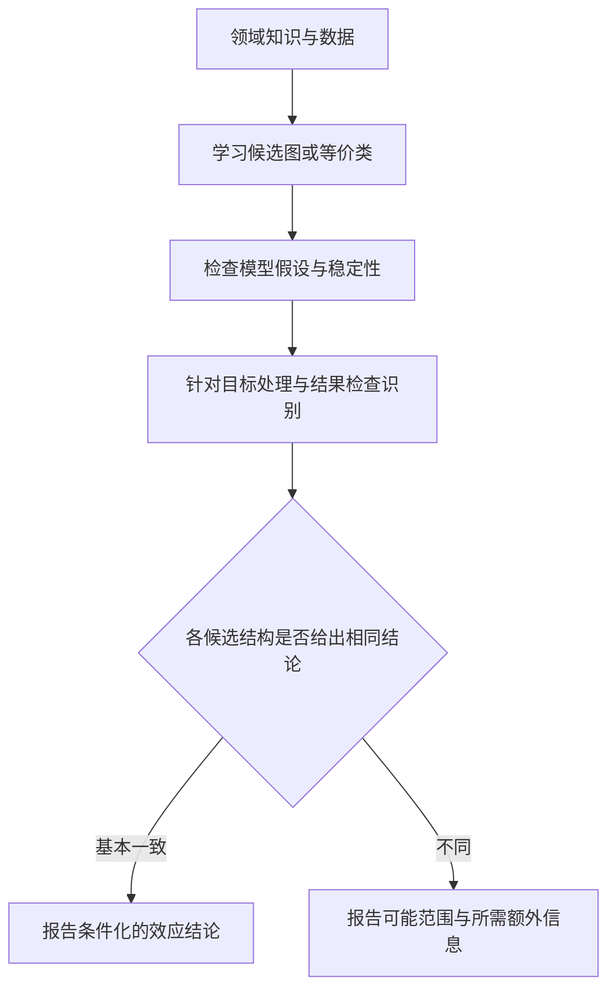

# 第三讲：因果发现与方向识别

> 前置知识：条件独立、DAG、线性回归、第一讲的干预概念；了解矩阵运算有助于理解 LiNGAM。  
> 核心问题：当因果图未知时，观测数据能够告诉我们哪些结构信息？为什么有些方向可识别，有些不能？

## 一、学习目标

完成本讲后，应能够：

1. 区分因果效应估计与因果结构发现。
2. 解释因果 Markov 条件、忠实性和因果充分性。
3. 判断简单 DAG 是否 Markov 等价，理解等价类的含义。
4. 叙述 PC 算法与评分搜索的基本步骤及输出边界。
5. 解释 ICA 与 LiNGAM 的联系，说明非高斯噪声为什么有助于定向。
6. 运用加性噪声与后非线性模型的思路讨论方向，并正确处理“不确定”的结果。

## 二、因果发现究竟要发现什么？

第二讲通常先给定足够的结构或设计知识，再估计某条干预的后果。本讲把结构本身作为未知对象。

可能的目标包括：

- **骨架：**哪些变量之间存在直接连接？
- **方向：**哪些连接可以定向为原因指向结果？
- **局部结构：**某个目标变量有哪些直接原因和直接后果？
- **等价类：**哪些不同结构仍与同一观测分布相容？
- **潜变量信息：**是否存在与未测共同原因相容的结构线索？

因果发现的输出不一定是一张完全定向的 DAG。输出部分方向，或者明确无法定向，往往比强行选一张图更符合现有证据。

### 贯穿案例的扩展

若只知道“新广告策略、落地页互动程度、转化效率”三者相关，我们可能考虑：

```text
新广告策略 → 落地页互动程度 → 转化效率
新广告策略 ← 落地页互动程度 → 转化效率
新广告策略 ← 落地页互动程度 ← 转化效率
```

第三种结构若涉及评估期末的转化效率影响此前新广告策略，与明确时间顺序冲突，可被领域知识排除；但若变量测量跨期混杂，不能仅凭变量名称判断。

本讲先讨论一般节点 $V_1,V_2,V_3$，再把时间顺序和领域知识作为额外信息加入。

## 三、从图到分布：三项基础假设

### 3.1 因果 Markov 条件

给定 DAG，每个变量在给定其父节点后，与其非后代中的其他节点条件独立。相应联合分布可按图分解：

$$
p(v_1,\ldots,v_p)=\prod_{j=1}^pp(v_j\mid pa_j).
$$

结合 d-分离，可以从图推导条件独立关系。该方向是“结构约束分布”，但任意一个统计分解本身并不自动赋予因果含义。

### 3.2 忠实性

忠实性要求数据中的独立关系能够由图上的 d-分离解释，不是不同因果路径恰好相互抵消产生的额外独立。

考虑：

$$
V_2=aV_1+\varepsilon_2,\qquad
V_3=bV_1+cV_2+\varepsilon_3.
$$

代入后得到：

$$
V_3=(b+ca)V_1+c\varepsilon_2+\varepsilon_3.
$$

如果 $b=-ca$，两条效应路径抵消；在适当独立噪声条件下，$V_1$ 与 $V_3$ 可以独立，但图上仍有相连路径。此时仅凭独立检验可能漏掉真实结构。

近似抵消也会造成小样本中的困难。忠实性属于机制假设，不能通过一次拟合优度检验完全确认。

### 3.3 因果充分性

经典 PC 分析常假设观测变量集合已包含相关的共同原因，也就是没有未观测混杂。在实际应用中，这可能很强。

此外，通常需要明确是否无环、样本是否来自稳定机制、是否独立同分布以及是否存在选择偏差。针对时间序列、潜变量或反馈系统，需要采用与之相符的方法。

## 四、Markov 等价：为什么观测独立信息不能确定所有方向？

### 4.1 两个变量时的困难

单凭任意联合分布，可以同时写成：

$$
p(v_1,v_2)=p(v_1)p(v_2\mid v_1)=p(v_2)p(v_1\mid v_2).
$$

因此，“能够拟合某方向的条件分布”不证明该方向就是因果方向。需要进一步限制模型类别、引入时间知识或获取干预信息。

### 4.2 三节点示例

以下三个图具有相同的条件独立信息：

```text
G1：V1 → V2 → V3
G2：V1 ← V2 → V3
G3：V1 ← V2 ← V3
```

三者都蕴含：

$$
V_1\perp V_3\mid V_2.
$$

如果没有额外信息，条件独立方法一般不能在三者之间唯一选择。

与它们不同的是碰撞结构：

```text
G4：V1 → V2 ← V3
```

它通常表现为 $V_1\perp V_3$，而给定 $V_2$ 后两端相关。

### 4.3 等价判据

对于 DAG 的 Markov 等价，两个图具有相同骨架和相同的无屏蔽碰撞结构，当且仅当它们蕴含相同的条件独立关系。

“无屏蔽”指碰撞点的两端节点不相邻。例如 $V_1\to V_2\leftarrow V_3$ 中，$V_1$ 与 $V_3$ 之间没有边。

注意：Markov 等价针对观测条件独立信息，并不意味着图中的干预效果也相同。对某个变量进行干预，可能区分原先等价的结构。

### 4.4 CPDAG 表达什么？

CPDAG 用有向边表达等价类中共同确定的方向，用无向边表达仍可在成员图之间变化的方向。

例如三节点非碰撞链的等价类可表示为：

```text
V1 — V2 — V3
```

这不表示三个变量没有因果方向，只表示当前假设与观测独立信息还不足以确定方向。无向边也不表示两个方向可以任意独立选择，选择时仍必须避免产生不属于该等价类的结构。

## 五、基于约束的方法：PC 算法

### 5.1 基本思想

从完全无向图开始，通过条件独立检验删除不需要的边，随后利用分离集合识别碰撞结构，再传播能够确定的方向。

课堂伪代码：

```text
输入：观测数据、条件独立检验、显著性阈值
1. 建立完全无向图。
2. 从空条件集合开始，逐步增加条件集合大小。
3. 若某对节点在给定某集合后独立：
   删除两者之间的边，并记录分离集合。
4. 根据无屏蔽三元组和分离集合确定碰撞结构。
5. 运用定向规则传播方向，避免有向环和不允许的新碰撞结构。
输出：部分定向图；在理想假设和适当实现下表示 Markov 等价类。
```

实际 PC 实现使用邻接集缩小条件集合搜索空间。PC-stable 等改进用于减轻有限样本结果对变量处理顺序的依赖。

### 5.2 条件独立检验如何选择？

| 数据与模型 | 可考虑的检验 | 限制 |
|---|---|---|
| 联合高斯连续变量 | 偏相关检验 | 零偏相关与条件独立的等价依赖高斯条件 |
| 离散变量 | 条件列联表检验 | 高维条件集容易使单元格稀疏 |
| 一般连续非线性变量 | 核或其他非参数检验 | 需要足够样本，计算和调参更复杂 |

未拒绝独立原假设不等于证明独立，尤其在条件集合较大时。早期误删一条边可能影响后续定向。

### 5.3 手工例子：三节点链

假设检验发现：

- 三对变量边际上都相关。
- $V_1\perp V_3\mid V_2$。

先删除 $V_1-V_3$，记录 $Sep(V_1,V_3)=\{V_2\}$，留下骨架 $V_1-V_2-V_3$。

对无屏蔽三元组，课堂使用如下定向规则：如果中间节点属于两端的分离集合，就把两个箭头指向中间节点。理由是条件化中间节点消除了两端依赖，说明两端共同汇入该节点。

因此，本例的输出为：

```text
V1 → V2 ← V3
```

该规则把条件独立信息直接转换为方向，是手工练习中需要掌握的关键步骤。

### 5.4 一个方向传播规则

若已有 $V_1\to V_2-V_3$，且 $V_1,V_3$ 不相邻，为避免引入新的无屏蔽碰撞结构，应定向 $V_2\to V_3$。

若已有一条从 $V_1$ 指向 $V_3$ 的有向路径，并存在未定向边 $V_1-V_3$，则不能把这条边定为 $V_3\to V_1$，否则产生有向环。

完整实现应使用系统化定向规则。课堂示例用于说明原理，不能替代成熟算法的全部规则。

### 5.5 允许潜在混杂：FCI 的位置

当可能存在未测共同原因或选择偏差时，可以考虑 FCI 类算法，其输出通常是部分祖先图 PAG，而不是普通 CPDAG。

PAG 端点含义与普通箭头不同，圆圈表示端点尚未确定。把 PAG 强行画成一张无潜变量 DAG 会丢失或扭曲结论。FCI 也依赖适当的 Markov、忠实性和检验条件，并非能无条件解决隐藏变量问题。

## 六、基于评分的方法：搜索更合适的结构

### 6.1 评分的构成

对候选 DAG $G$，一种常用评分形式为：

$$
Score(G)=\log L(\widehat\theta_G;D)-\frac{k_G}{2}\log n.
$$

这里使用“对数似然减惩罚、越大越好”的 BIC 等价表达；有些软件输出 $-2\log L+k\log n$，则越小越好。比较时需先确认符号约定。

拟合项鼓励解释数据，惩罚项限制过于复杂的图。可分解评分允许根据局部父节点集合计算节点分数，减少搜索成本。

### 6.2 搜索方法

- 贪心爬山：考虑加边、删边、翻转边等局部操作。
- GES：在等价类空间中进行前向和后向搜索，利用评分等价性。
- 混合方法：先通过独立检验限制候选骨架，再用评分搜索方向或结构。

局部最优、评分设定和有限样本误差都会影响输出。算法给出一张 DAG，不代表其中每个方向都已经获得独立的因果证据。

### 6.3 评分等价的含义

如果评分对 Markov 等价图相同，它就不会仅凭分数区分这些图。要进一步定向，仍需额外结构假设、领域知识或干预。

因此“得分最高”与“因果方向已唯一识别”是不同结论。评分方法和约束方法可能利用不同统计信息，但都必须解释自身假设。

## 七、函数型因果模型：通过机制不对称性定向

一般形式为：

$$
V_j=f_j(Pa_j,N_j).
$$

在相应因果充分性设定下，噪声项彼此独立，且与节点的原因满足必要独立关系。

若允许任意函数和任意噪声表示，正反两个方向都可能解释数据。方向识别的关键在于对函数或噪声施加有意义的限制，使两个方向不再对称。

| 方法 | 主要限制 | 方向信息来自哪里 |
|---|---|---|
| LiNGAM | 线性、无环、独立非高斯噪声 | 非高斯独立分量的结构 |
| ANM | 原因函数加独立噪声 | 正反方向的残差独立性不对称 |
| PNL | 可逆外层变换加内部加性噪声 | 变换后独立噪声表示的非对称性 |

## 八、ICA 与 LiNGAM

### 8.1 ICA 的直观含义

独立成分分析 ICA 考虑：

$$
\mathbf V=C\mathbf N,
$$

观测信号是若干相互独立源信号的线性混合。ICA 尝试恢复混合矩阵及独立源。典型直观例子是多个麦克风接收到多个独立声源的混合。

在通常的线性 ICA 条件下，非高斯性帮助排除大量同样不相关但并不独立的旋转。仅有协方差信息通常不足以唯一恢复独立源；结果还存在排列和尺度的不确定性。

### 8.2 LiNGAM 的结构方程

对中心化变量，设：

$$
\mathbf V=B\mathbf V+\boldsymbol\varepsilon.
$$

$B_{jk}$ 表示节点 $V_k$ 对 $V_j$ 的直接线性作用，故 $B$ 的行对应结果、列对应原因。

整理后：

$$
\mathbf V=(I-B)^{-1}\boldsymbol\varepsilon=C\boldsymbol\varepsilon.
$$

这就是 ICA 混合模型。无环性意味着经适当变量排列后，$B$ 可以写成严格三角矩阵。

### 8.3 识别条件与算法思路

经典 LiNGAM 主要假设：

1. 变量之间是线性关系。
2. 不存在有向环。
3. 不存在未测共同原因。
4. 扰动相互独立、具有非高斯分布和非零方差。

原始 ICA 路线的思路是：

1. 用 ICA 估计解混矩阵。
2. 处理独立成分排列的不确定性，使其对应于节点扰动。
3. 利用对角线归一化处理尺度不确定性。
4. 恢复 $B$，结合无环约束排列与修剪边。

“调用 ICA”本身并不等于完成因果发现。把源信号映射回结构方程需要模型约束，且有限样本中估计和数值优化可能失败。

### 8.4 三变量手算

设：

$$
V_1=\varepsilon_1,\qquad
V_2=0.8V_1+\varepsilon_2,\qquad
V_3=-0.5V_1+1.2V_2+\varepsilon_3.
$$

则：

$$
B=\begin{pmatrix}
0&0&0\\
0.8&0&0\\
-0.5&1.2&0
\end{pmatrix}.
$$

代入得到：

$$
V_3=0.46\varepsilon_1+1.2\varepsilon_2+\varepsilon_3,
$$

所以：

$$
C=(I-B)^{-1}=\begin{pmatrix}
1&0&0\\
0.8&1&0\\
0.46&1.2&1
\end{pmatrix}.
$$

$V_1$ 对 $V_3$ 的直接效应是 $-0.5$，经 $V_2$ 的间接效应是 $0.8\times1.2=0.96$，总效应是 0.46。识别图后仍要区分直接与总效应。

### 8.5 DirectLiNGAM 的直觉

若某变量是外生节点，把其他变量对它回归后，适当条件下残差与它独立。DirectLiNGAM 逐步利用这种性质寻找外生节点，并在残差系统中继续寻找因果顺序。

这里需要的是独立性，不能只检查线性不相关。非高斯性与其他结构条件失效时，定向依据也可能失效。

## 九、加性噪声模型 ANM

### 9.1 模型与识别思路

正向模型：

$$
Y=f(X)+N_Y,\qquad N_Y\perp X.
$$

这里的 $X$ 是一般原因变量，不再专指第一、二讲中的基线协变量。

尝试反向模型：

$$
X=g(Y)+N_X,\qquad N_X\perp Y.
$$

很多非线性机制只允许一个方向具有“函数加独立噪声”的形式，因此可以利用这种不对称性定向。

### 9.2 一个直观例子

设：

$$
X\sim N(0,1),\qquad N_Y\sim N(0,\sigma^2),\qquad Y=X+X^3+N_Y,
$$

且 $X,N_Y$ 独立。正向条件分布随 $X$ 改变只是围绕 $f(X)$ 平移；反向条件分布的形状通常随 $Y$ 改变，难以表示为一个固定分布的独立加性噪声。

这个例子说明非线性为何可能带来方向信息，不意味着所有非线性模型都能唯一识别。

### 9.3 为什么线性高斯情形不能这样定向？

若：

$$
X\sim N(0,\sigma_X^2),\qquad Y=bX+N_Y,
$$

且 $N_Y$ 为独立高斯噪声，则 $(X,Y)$ 联合高斯。

反向线性回归系数为：

$$
\gamma=\frac{Cov(X,Y)}{Var(Y)}.
$$

定义 $N_X=X-\gamma Y$，有 $Cov(N_X,Y)=0$。由于联合高斯，不相关进一步推出独立，因此两个方向都存在独立加性噪声表示。

这不是算法没有调好，而是当前模型类别下的方向识别限制。

### 9.4 实际操作

1. 划分训练集和检验集，或采用适当交叉拟合。
2. 训练 $\widehat f$，在留出数据上计算 $\widehat N_Y=Y-\widehat f(X)$。
3. 检验 $X$ 与 $\widehat N_Y$ 的独立性。
4. 反向拟合 $\widehat g$ 并检验 $Y$ 与 $\widehat N_X$ 的独立性。
5. 综合两边结果、拟合质量与结构假设解释方向。

可采用核独立性检验等工具；检验方式应与残差估计、样本依赖及置换方案匹配。

### 9.5 四种输出情形

| 正向残差独立性 | 反向残差独立性 | 合理解释 |
|---|---|---|
| 未拒绝 | 拒绝 | 在 ANM 假设与检验有效条件下支持正向 |
| 拒绝 | 未拒绝 | 在相应条件下支持反向 |
| 未拒绝 | 未拒绝 | 可能不可识别或检验功效不足，保留不确定 |
| 拒绝 | 拒绝 | 可能模型错设、潜在混杂、测量误差或拟合不足 |

不能简单选择独立检验 $p$ 值较大的方向并宣称已经证明因果关系。独立性未被拒绝只是当前检验未发现足够的违背证据。

### 9.6 为什么预测误差不能直接定向？

正反方向的结果变量不同，其单位、方差和噪声水平也不同。把转化效率从“每千人转化数”改成百分比，就会改变原始均方误差的大小。

即使先标准化，预测表现仍不是 ANM 的核心识别条件。关键是给定模型类别下原因与噪声的独立结构，而不是哪一个方向的回归更好预测。

## 十、后非线性模型 PNL

### 10.1 模型形式

$$
Y=f_2\{f_1(X)+N_Y\},\qquad N_Y\perp X,
$$

其中 $f_2$ 可逆。

- $f_1$ 表达原因对结果内部机制的作用。
- $N_Y$ 表达内部噪声。
- $f_2$ 表达可逆的外层非线性变换，例如测量尺度变换。

若 $f_2$ 为恒等函数，就退化为 ANM。若它不是恒等函数，直接对 $Y$ 拟合加性噪声可能不合适。

### 10.2 残差应在哪里计算？

估计相应变换后，内部残差形式为：

$$
\widehat N_Y=\widehat f_2^{-1}(Y)-\widehat f_1(X).
$$

需要检验该残差与原因变量的独立性，而不是直接把 $Y-\widehat f_1(X)$ 当作噪声。

### 10.3 识别边界

PNL 在较广的函数与分布条件下可识别，但存在特殊不可识别情形，并非任意非线性变换都允许唯一因果定向。

可逆外层变换也不同于任意测量误差。如果观测值被离散化、截断或加入额外随机测量噪声，可能已经超出基本 PNL 模型。更灵活的模型还会增加估计难度与样本需求。

## 十一、模拟实验：让学生看到成功与失败

以下方案是实验设计，不是已经运行得到的实证结果。每种情形使用多个随机种子，比较不同样本量，例如 300、1000 和 3000。

| 场景 | 数据生成方式 | 学习重点 |
|---|---|---|
| A：线性高斯 | $Y=0.8X+N$，$X,N$ 独立高斯 | 双向独立噪声表示可能成立 |
| B：线性非高斯 | $Y=0.8X+N$，$X,N$ 独立 Laplace | 非高斯性带来的定向信息 |
| C：非线性 ANM | $Y=X+X^3+N$，独立噪声 | 非线性机制的不对称性 |
| D：未测混杂 | $X=U+N_X, Y=U+N_Y$ | 相关不意味着存在直接边 |
| E：近忠实性违背 | 两条路径的系数近似抵消 | 独立检验漏边与不稳定性 |
| F：PNL | $Y=\exp\{f(X)+N\}$ | 需要在变换后检查独立噪声 |

### 11.1 需要提交的结果

1. 数据生成式、噪声分布与随机种子。
2. 数据散点图和正反向残差图。
3. 条件独立或残差独立检验的设定。
4. 各方法输出的图或方向及无法定向比例。
5. 正确方向率、错误方向率、未定向率，并说明分母。
6. 针对模型假设违背的解释。

必须把“未定向”单独统计。只在成功定向的样本中报告正确率，会掩盖方法经常无法作出判断的事实。

### 11.2 图结构评价

可以报告骨架边的精确率与召回率、可识别方向的正确率以及结构 Hamming 距离。但应明确对未定向边、反向边和等价类如何计分。

评价 CPDAG 时，应与真实等价类或其可识别部分相比较，不能因为算法保留一个理论上不可定向的边就简单算作算法失败。

### 11.3 稳定性分析

改变样本划分、检验阈值、变量顺序和回归复杂度，观察边与方向是否稳定。重复抽样得到的边出现频率是算法稳定性指标，不自动等于某条因果边为真的概率。

## 十二、如何结合领域知识和干预数据？

### 12.1 时间顺序

明确发生在处理之后的变量不能作为处理之前的原因，但同一时间窗汇总的数据可能掩盖反馈。时间先后可以排除部分方向，却不能排除共同原因。

### 12.2 背景约束

可以把可信知识作为禁止边、必须边或时间层级约束加入搜索。报告时应区分：

- 由数据和算法支持的结构。
- 由先验约束固定的结构。
- 两者均不能确定的结构。

### 12.3 干预如何打破等价？

对于 $X\to Y$ 与 $X\leftarrow Y$ 两种候选结构，若能真正干预 $X$，在其他机制稳定且设计合适时，$Y$ 是否随之改变可以提供方向信息。

但未观察到变化也可能来自效应小、干预执行不足、统计功效不足或效应抵消。实验结果仍需结合具体设计解释。

## 十三、从发现的图返回效应估计

拿到候选图后，可以针对每个与证据相容的结构检查目标效应是否识别，再比较相应估计或可能范围。

例如，某等价类中部分图认为 $A$ 是 $Y$ 的原因，部分图认为 $Y$ 是 $A$ 的原因，则不能随意选一张图后只报告一个确定的干预效应。

推荐流程：



用同一数据选择图再估计效应，还会带来结构选择的不确定性。只计算固定图下的标准误，可能低估整个流程的误差。

## 十四、常见误区与纠正

| 误区 | 纠正 |
|---|---|
| 软件画出的箭头都是已证实因果 | 先确认输出类型、假设和定向依据 |
| Markov 等价图有相同干预效果 | 等价针对观测独立信息，干预结果可不同 |
| 非高斯观测变量足以使用 LiNGAM | 关键还包括扰动独立、非高斯、线性、无环、无潜在混杂等 |
| 残差零相关就是独立 | 非高斯和非线性情形下通常不成立 |
| 任意非线性都能定向 | ANM 和 PNL 均有不可识别或假设不适用的情形 |
| 正向预测误差更小就选正向 | 预测误差不是通用因果定向准则 |
| FCI 可以无条件发现所有潜变量 | FCI 输出的是相应假设下的部分结构信息 |
| 多次抽样出现率就是因果概率 | 稳定性频率不是自动校准的因果后验概率 |

## 十五、习题与参考答案

### 题 1：Markov 等价

比较 $X\to M\to Y$ 与 $X\leftarrow M\to Y$。仅依赖条件独立信息能否区分？

**答案：**一般不能。二者有相同骨架和无屏蔽碰撞结构，均蕴含 $X\perp Y\mid M$，属于同一 Markov 等价类。

### 题 2：PC 定向

骨架为 $X-M-Y$，$X,Y$ 不相邻，记录分离集合 $Sep(X,Y)=\{M\}$。应如何定向？

**答案：**由于中间节点 $M$ 属于分离集合，应定为 $X\to M\leftarrow Y$；条件化 $M$ 消除了两端依赖，因此它是两端共同汇入的碰撞点。

### 题 3：不相关与独立

$X$ 关于零对称，$Y=X^2$。为什么只用 Pearson 相关检查独立性可能失败？

**答案：**在适当矩存在时 $E(X^3)=0$，从而 $Cov(X,X^2)=0$，但 $Y$ 完全由 $X$ 决定，二者显然不独立。

### 题 4：LiNGAM 矩阵方向

在 $\mathbf V=B\mathbf V+\varepsilon$ 中，$B_{32}=1.2$ 表示什么？

**答案：**$V_2$ 对 $V_3$ 的直接线性效应为 1.2。不要把矩阵行列对应的方向反过来。

### 题 5：总效应

$V_2=0.8V_1+\varepsilon_2$，$V_3=-0.5V_1+1.2V_2+\varepsilon_3$。$V_1$ 对 $V_3$ 的总效应？

**答案：**$-0.5+0.8\times1.2=0.46$。直接与间接效应符号相反。

### 题 6：ANM 双向未拒绝

正反向独立性检验都未拒绝，是否可以选 $p$ 值更大的方向？

**答案：**不能据此给出确定方向。可能处于不可识别模型、独立关系或检验功效不足，应报告当前信息不足，并考虑额外知识或干预。

### 题 7：模型失配

正反向 ANM 都拒绝残差独立，至少提出三种解释。

**答案：**可能有未测混杂，真实机制属于非加性模型，存在测量误差，回归拟合不足，或者检验与数据依赖结构不匹配。不能直接断言二者没有因果关系。

### 题 8：PNL

$Y=\exp(X^3+N)$ 且 $N\perp X$。应在哪个尺度考察加性噪声？

**答案：**在 $\log Y=X^3+N$ 的内部尺度上考察残差与 $X$ 的独立性，并说明 $Y>0$ 和外层变换可逆的条件。

## 十六、阅读指引

按“等价类→结构学习→函数模型”的顺序阅读。

| 材料 | 重点 | 带着什么问题阅读 |
|---|---|---|
| Verma 与 Pearl，Equivalence and Synthesis of Causal Models | 等价关系与图判据 | 为什么同样的独立信息对应多张图？ |
| Spirtes、Glymour、Scheines，Causation, Prediction, and Search | 条件独立与结构搜索 | 算法需要哪些假设，输出什么？ |
| ICA 教程 | 独立源、混合与非高斯性 | 不相关与独立有什么差别？ |
| Shimizu 等，2006 LiNGAM | 线性非高斯无环模型 | 如何把 ICA 结果转成结构矩阵？ |
| Hoyer 等，Nonlinear causal discovery with additive noise models | 独立加性噪声和不可逆性 | 哪些正反向模型可以同时成立？ |
| Zhang 与 Hyvärinen，2009 PNL | 后非线性结构及可识别性 | 可逆外层变换如何改变建模方式？ |

本讲只给出识别直觉与教学级推导，不展开 ANM/PNL 可识别性的微分方程证明。有关“通常可识别”的说法均以论文给定的模型和正则条件为背景。

- 等价类原始论文（参考文献）
- 结构发现教材目录（参考文献）
- ICA 教程（参考文献）
- LiNGAM 原始论文（参考文献）
- ANM 原始论文（参考文献）
- PNL 原始论文（参考文献）

## 十七、综合作业：从一张图到一份研究报告

选择一个教育或社会科学问题，提交 3—5 页报告，内容包括：

1. 变量定义、测量时间与数据来源。
2. 领域知识支持的候选 DAG。
3. 一种结构学习方法及其假设。
4. 算法输出与无法确定的方向。
5. 针对一个具体干预目标的识别与估计方案。
6. 对未测混杂、模型失配和外推的讨论。
7. 能够进一步区分候选结构的一项数据收集或实验建议。

**建议评分：**研究问题与变量定义 20%，假设论证 25%，方法实施 20%，结果解释 20%，局限与后续设计 15%。不以“发现的箭头更多”作为评分标准。

**三讲总结：**先把因果问题定义清楚，再说明识别依赖的假设，最后用与目标一致的方法估计或学习结构。把无法由当前证据确定的部分明确留下，是完整结论的一部分。

**导航：**[第一讲](lecture-01.md) · [第二讲](lecture-02.md)。
